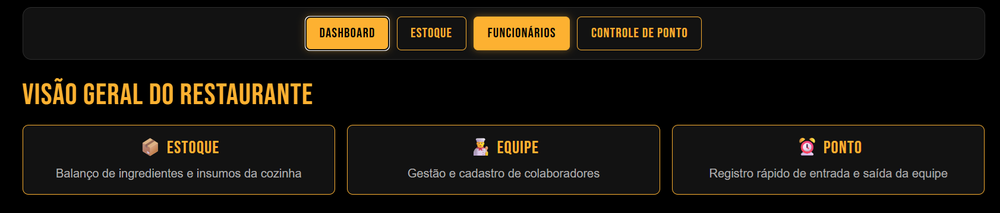
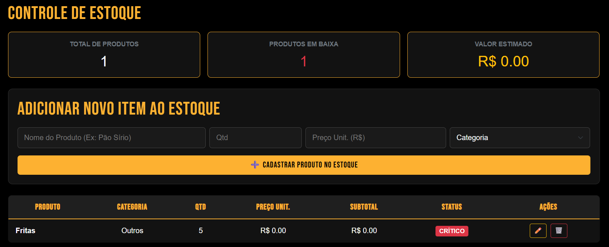

# 🦒 Yellow Giraffe - Website & Sistema Operacional

Website institucional do restaurante **Yellow Giraffe**
---

## 🍽️ Funcionalidades do Site

- **Home (`index.html`)**: Apresentação da casa, banners promocionais, informações de delivery e especialidades
- **Onde Estamos (`ondeEstamos.html`)**: Localização e contato da unidade
- **Especialidades (`principaisOp.html`)**: Cardápio com os principais lanches e pratos

---

## 👨‍🍳 Área do Funcionário (Gestão & Dashboards)

O portal administrativo e operacional da empresa fica localizado no arquivo:

👉 **`dashboard.html`** *(acessível também pelo link **"Área do Funcionário"** no rodapé do site)*



* **Menu inicial:** Ponto central de navegação do sistema de gestão.
* **Gerente:** Acesso total a todas as funções e configurações.
* **Copeiro/Cozinheiro:** Acesso limitado ao dashboard operacional.

---



---

> ℹ️ **Acesso aos Painéis Internos:**  
> Para consultar os dashboards operacionais, controle de ponto e gestão de estoque, clique em **"Área de Funcionário"** no rodapé da página inicial ou abra diretamente o arquivo **`dashboard.html`**.

---


# Backend & Base de Dados
daqui a pouco eu documento isso aq :)


# 📋Mudanças

### 🧹 Limpeza e Ajustes de Escopo
- [X] Remover temporariamente as abas **RH**, **Mesas** e **Pedidos** (aguardando definição futura).

---

### 📦 Módulo de Estoque
- [X] Tornar o campo **Preço Unitário** não obrigatório no cadastro de produtos.
- [X] Ocultar a coluna/valores de preços e valor total para o cargo de **Copeiro**.
- [X] Permitir a visualização de preços e totais financeiros exclusivamente para o **Gerente**.
- [X] Restringir a permissão de alteração (adicionar, editar, excluir itens) apenas para **Gerente** e **Copeiro** (outros cargos apenas visualizam).

---

### 👥 Módulo de Funcionários
- [X] Ocultar a aba e o acesso a **Funcionários** para todos os cargos, deixando visível somente para o **Gerente**.

---

### 🗄️ Autenticação & Banco de Dados
- [X] Implementar sistema de login com validação de credenciais e identificação de cargos.
- [X] Conectar banco de dados centralizado para persistência de logins e dados operacionais (estoque, funcionários, dashboard).
- [ ] Integrar o back-end com o front-end.

---

### 💡 Ideia Futura: Escala & Turnos da Equipe

- [ ] **Quadro Interativo de Escalas:** Substituir o controle de ponto por uma tabela visual com os turnos de trabalho e dias de folga de cada colaborador.
- [ ] **Controle de Acesso da Escala:** Permitir a visualização de turnos para toda a equipe, mas restringir a edição e alterações apenas para usuários autorizados (ex: Gerente).

---

### 📥 Como Baixar e Acessar o Site

Siga o passo a passo abaixo para visualizar o site diretamente no seu computador.

#### 1. Fazer o Download do Projeto
1. Acesse a página do projeto: [Repositório Yellow Giraffe](https://github.com/kayquevo/Yellow-Giraffe-site).
2. Clique no botão verde **`<> Code`** no canto superior direito.
3. No menu que se abrir, clique em **`Download ZIP`**.

---

#### 2. Descompactar a Pasta
1. Abra a sua pasta de **Downloads** e localize o arquivo baixado (`Yellow-Giraffe-site-main.zip`).
2. Clique nele com o botão direito do mouse e selecione **"Extrair Tudo..."**

---

#### 3. Abrir o Site no Navegador
1. Entre na pasta descompactada.
2. Dê **dois cliques** no arquivo **`index.html`**.
3. O site será aberto automaticamente no seu navegador.

---

### 🛠️ Instruções de Instalação e Execução do BackEnd

1. **Python (versão 3.10 ou superior)**

2. **MySQL Server & MySQL Workbench**
   * Lembre-se da senha que você definiu para o usuário `root`, pois ela será usada mais tarde.

---

**Banco de Dados**

1. Abra o **MySQL Workbench** e conecte-se ao seu servidor local (usuário `root`).
2. No menu superior, vá em **File > Open SQL Script...** e selecione o arquivo:
   ```text
   backend/database/yellow_giraffe_schema.sql
   ```
3. Clique no ícone de raio no topo da tela para executar o script completo.
4. Para confirmar que foi criado com sucesso:
   * No painel esquerdo, clique na aba **Schemas**.
   * Clique no botão de atualizar.
   * O banco de dados **`yellow_giraffe`** deve surgir na lista com as tabelas de funcionários, cargos, estoque e permissões criadas.

**Configuração**

5. Abra o arquivo `backend/config.py` no seu editor de código (como o VS Code).
6. Procure a linha onde está a variável `DB_PASSWORD`:
   ```python
   DB_PASSWORD = os.environ.get("DB_PASSWORD", "")
   ```
7. Coloque a palavra-passe do utilizador `root` do seu MySQL entre as aspas:
   ```python
   DB_PASSWORD = os.environ.get("DB_PASSWORD", "A_SUA_SENHA_AQUI")
   ```
8. Guarde o ficheiro (`Ctrl + S`).

**Instalação**

9. Abra o terminal (PowerShell, CMD ou o terminal integrado do VS Code).
10. Navegue até a pasta do backend:
    ```bash
    cd backend
    ```
11. Instale todas as bibliotecas necessárias listadas no arquivo `requirements.txt`:
    ```bash
    pip install -r requirements.txt
    ```
    *Este comando baixa pacotes como o Flask, o conector do MySQL e os módulos de criptografia de senhas e autenticação.*

**Usuário**

12. No mesmo terminal dentro da pasta `backend`, execute o script de registo:
    ```bash
    python criar_usuario.py
    ```
13. O terminal irá solicitar os seguintes dados para guardar na base de dados:
    * **Nome:** (ex.: `Kayque`)
    * **E-mail:** (ex.: `kayque5925@gmail.com`)
    * **Senha:** (defina uma palavra-passe segura; ela será encriptada automaticamente)
    * **Cargo:** `Gerente` *(utilize exatamente este nome para obter acesso total)*
14. Prima **Enter** para concluir o registo até surgir a confirmação no terminal.

**Servidor**

15. No terminal aberto na pasta `backend`, execute o ficheiro principal da API:
    ```bash
    python app.py
    ```
16. O servidor ficará ativo e acessível localmente em `http://localhost:5000` (ou `http://127.0.0.1:5000`).
17. **Importante:** Mantenha esta janela do terminal aberta; se fechá-la ou interromper com `Ctrl + C`, a API deixará de responder às requisições.

**Testes via PowerShell**

Abra uma segunda janela ou aba do terminal (PowerShell) para enviar os pedidos à API enquanto o `app.py` continua em execução.

18. Fazer o Login e Guardar o Token Automaticamente:
    Execute o comando abaixo com o e-mail e a palavra-passe criados anteriormente. O PowerShell guardará o token JWT completo diretamente na variável `$token`:
    ```powershell
    $resp = Invoke-RestMethod -Uri "http://localhost:5000/api/login" -Method Post -ContentType "application/json" -Body '{"email":"kayque5925@gmail.com","senha":"kayque59253"}'
    $token = $resp.token
    ```

19. Inserir um Produto no Stock (POST):
    Envie o produto com o token de autenticação no cabeçalho:
    ```powershell
    Invoke-RestMethod -Uri "http://localhost:5000/api/estoque" -Method Post -Headers @{ Authorization = "Bearer $token" } -ContentType "application/json" -Body '{"nome_produto": "Pao sirio", "id_categoria_produto": 1, "quantidade": 20, "unidade_medida": "un"}'
    ```
    * **Resposta esperada:** A API devolverá a confirmação com o identificador criado, como `{"id_produto": 1}`.

20. Consultar os Itens no Stock (GET):
    Para listar os produtos gravados na base de dados:
    ```powershell
    Invoke-RestMethod -Uri "http://localhost:5000/api/estoque" -Method Get -Headers @{ Authorization = "Bearer $token" }
    ```
    * **Resposta esperada:** Uma lista em JSON com os detalhes do produto (nome, categoria associada, quantidade e stock mínimo).


